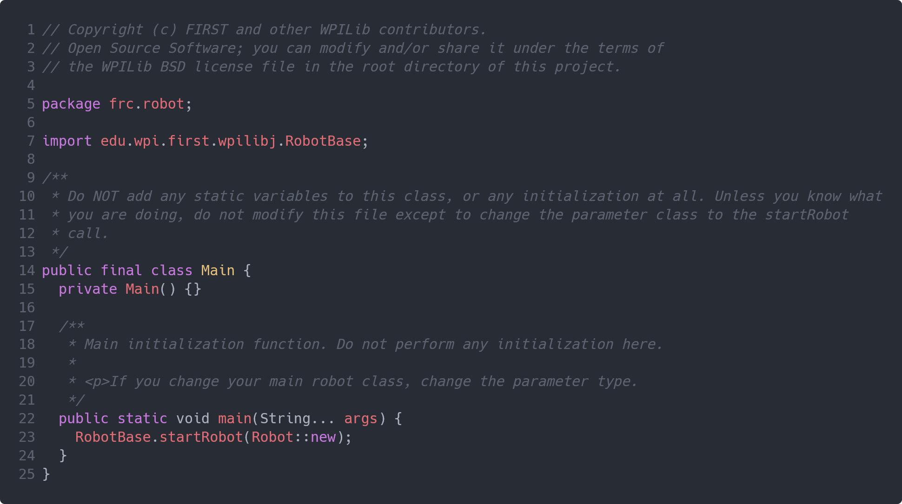

# 13. 401's 2023 Robot

---
## Overview

This exercise is a long reading on how a robot project works at a more fundamental level. To do this we'll examine team [401's code]() from last year.

### Terms to know
 
 - [JNI](https://en.wikipedia.org/wiki/Java_Native_Interface) - Allows Java to run more performant code written in C++

---

### `Main.java`

