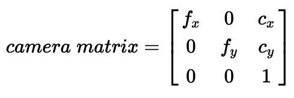

# 19. Computer Vision

**Note:** This lesson is <u>optional</u>. You do not have to read this, it's a long read, but stuff discussed in here will appear in this year's code.

## What's an Apriltag?

<figure>

<!---If you are reading this raw, now is the time to switch over to github, as this contains a lot of images which won't display for you--->
</figure>

Apriltags are what is called a visual fiducial system. A visual fiducial, or just a fiducial, is a standard sized object placed in an image to serve as a point of reference for measurement. This could be something as simple as a ruler. 

Apriltags, on the other hand, are a set standardized binary(black and white) patterns, similar to a QR code. The computer is then able to determine what ID the apriltag is based off of this pattern. 

## So what's the point?

When we use computer vision, we're looking for two things from the apriltag:
- It's ID
- It's pose relative to us

With Those, we can get out pose on the field

To accomplish this, we do a few things:
1. Find the apriltag in the image
2. Get it's ID
3. Get the 4 corners of the tag in pixels
4. Use those corners to estimate our pose

## Finding the Apriltag

From the camera, we get an image in the form of a frame. Let's use this image as an example:

<figure>

</figure>

This image is made up of a whole bunch of pixels, each with its own color value. But, we don't need color, do we? An apriltag is black and white. So the first step we do is what is called adaptive thresholding.

### Thresholding

Thresholding is the process of taking an image, and turning it into either black, white, or grey(ignored) pixels. There are two kinds of thresholding: Global Thresholding, and Adaptive Thresholding. Global Thresholding is much simpler: it simply takes each pixel and checks it against a set threshold. Depending where it lies, it gets set to it's color. 

Adaptive thresholding is a bit more complicated. Adaptive thresholding takes the mean pixel intensity in the area around the pixel, and uses that as the threshold to classify the pixel. Alternatively, some solutions group pixels into groups, and set the threshold for every pixel in the group, instead of having each pixel get it's own value. This can save tremendously on computer resources, but it may have an adverse impact on accuracy.

<figure>

<figcaption>The grey pixels are ignored by the computer.</figcaption>
</figure>

### Segmentation

The next step to detect our apriltag is segmentation. Segmentation is the process of finding the boundaries of objects within the image. There's a few ways to do this.

The easiest way to do this is to simply find pixels that have a neighbor of the opposite color, then draw the boundaries based on that. This approach is fairly efficient, but, when it gets to the point where a single pixel is dividing multiple groups, it has trouble determining boundaries.

A more complex approach can solve this issue. The connected color pixels are grouped using the [union find](https://www.youtube.com/watch?v=ibjEGG7ylHk) algorithm. For every pair of adjacent black and white groups, boundary pixels are found. This solves the problem by allowing 1 wide pixel groups to appear in multiple clusters. 

<figure>

</figure>

### Quad detection

Ok so now we have a whole bunch of boundaries. The problem is, those boundaries are just a whole bunch of unordered pixel values. That's what quad detection solves. Quad detection takes the unordered pixel groups, and divides them into 4 separate sub-groups, each of which makes up one line segment. 

The math behind this is very complicated, and I only have a loose understanding of it. But, it does its whole complicated math thing, and gets some groups of possible candidate corners. It then iterates through them, and filters out ones with high error, not 4 corners, and ones with angles too far off of 90.

As a result, we get all the relevant quads from the image. We do get some background quads as well, but we'll filter those out in the next step.

<figure>

<figcaption>Note: the computer still looks at the thresholded version, this is just overlaid against the greyscale to make it easier to see</figcaption>
</figure>

### Decoding

Ok, so now we have our quads, including all the ones relevant to the apriltag. Now, we have to figure out what the ID of the apriltag is. Apriltags are very computer friendly, as they are essentially just binary encoded into an image. 

The computer already has the spots where it changes colors. It also has the outer boundary of the tag. All it has to do is determine the size of each "bit" in pixels, then read it. Accounting for one or two bit errors, it then compares what it reads to a database of all the tags in that family, and gets the ID of the tag.

<figure>

<figcaption>Note: the computer still looks at the thresholded version, this is just overlaid against the greyscale to make it easier to see</figcaption>
</figure>

### Edge Refinement

Even though we already have the ID, we want to do one more thing. To continue on to pose estimation, we need the 4 corners of the tag. But, because of the thresholding we did, the corners we have already are a bit off. Thresholding can occasionally cause issues with large glare and shadows, which can cause edges to be off.

So, we take the current quads, and compare them against the original, greyscale image. Specifically, we take evenly spaced points on the quads, and compare the gradient. This gets us significantly more accurate corners, which will improve our pose estimation accuracy later on. 

If you are interested, and want to learn more, [here's](https://april.eecs.umich.edu/media/pdfs/wang2016iros.pdf) a paper that goes into more depth on the topic. This isn't the solution we use though, as the one we use doesn't have much documentation on how it works.

Keep in mind this is just one approach. Many different approaches exist, and can vary. Most though, will use similar methods to accomplish this. 

## Pose Estimation

Ok so now we have 4 pixel values that represent corners of an apriltag. But, we still need our pose. Good thing is, those 4 corners are all we need. 


### Distortion

Before we can estimate pose, we first have to get rid of camera distortion. Cameras are not going to perfectly capture an image. You will **never** find a perfect camera lens. Lenses mainly distort in what is called radial distortion. Radial distortion can occur three ways: barrel, pincushion, or a mixture of both. Here's what barrel and pincushion look like:

<figure>

</figure>

### Intrinsic Parameters

Ok, so how do we combat distortion? Well, we need what is called the intrinsic parameters of the camera we're using. Often, you'll find these represented in a matrix:

<figure>

</figure>

In this matrix, you get 4 parameters: *f*<sub>x</sub>, *f*<sub>y</sub>, *c*<sub>x</sub>, and *c*<sub>y</sub>.

**Focal Length**

Let's start with the *f*s. The *f*s represent the focal length of the camera. Focal length is the distance between the camera's "nodal point", or where the light converges, and the optical sensor. Here's a diagram that shows it better:

<figure>

</figure>

The shorter the focal length is, the more "wide" a shot will be, but it will also be more distorted. The more the focal length, the more "zoomed in" the shot will be, but the less distorted it will be. Here's a picture taken from the same point at multiple different focal lengths:

<figure>

<figcaption>Notice how the short focal length images are distorted, whereas the long ones are not.</figcaption>
</figure>

**Optical Center**

Now onto the *c*s. The *c*s represent the optical center of the camera. The optical center is the point where the light converges. 

*Note*: A camera with a lens does not actually have an optical center, but it still models the camera's optics quite closely. 

### Calibrating the Camera

Ok, so how do we get the intrinsic parameters? Well, luckily for us, OpenCV, a computer vision library, provides an easy and very accurate way to do this. 

The way OpenCV calibrates is by using a printed out standardized checkerboard. It finds the corners of the checkerboard in the image, and compares the distance in the image to the distance that it knows to be true, then solves for distortion coefficients. The more images it gets, the more it can refine it's data to be more accurate, and the more accurate your pose estimation will be. 12 is a good starting number if you want a basic calibration, but for the robot, we do around 400-500.

### Estimating the Relative Pose

Solving for the pose gets into math that we don't learn until senior year, and I only really have a loose grasp of how it does it. Suffice it to say, it does fancy math, and you get the translation and rotation of the apriltag relative to the camera.

## Putting it All Together

So we now have the relative pose to the apriltag and the ID of the apriltag. With these, we can now get our position on the field.

### Apriltag Placement

Each year, apriltags are scattered around the field in **set** positions. Thanks to the game manual, we already know these positions. Using that, we can turn the ID into a field pose. 

### Our Pose

You might be able to tell where I'm going with this. Combining the known pose of the apriltag with the relative pose, we can solve for our pose on the field, which has been the goal all along.

## Getting the Data to the RIO

We have the pose now, but, there's something I haven't told you. Everything so far has been done on a completely separate computer to the roboRIO, the main brain of the robot. We have to do this to:
1. Not completely overload the RIO with calculations
2. Optimize the pose estimation to minimize latency(we'll get into this later)

To transfer the data to the RIO, we use something called Network Tables, which is a library provided by WPILib to network between computers. NetworkTables is also the thing that dashboards use to display data from the robot.

## Working it In

Now that we have our pose on the RIO, we have to work it in with our odometry, so both can run in tandem, allowing for greater accuracy. 

To do this, we can use one of WPI lib's pose estimator classes. Here I'm going to show swerve, but you can replace that with whatever type of drivetrain you are using. 

Here's how you define a pose estimator:
```java
SwerveDrivePoseEstimator poseEstimator = new SwerveDrivePoseEstimator(
    swerveKinematics,
    gyroAngle,
    modulePositionsList,
    initialPose
);
```

To update odometry(remember, put this in a periodic):
```java
Pose2D pose = poseEstimator.update(
    gyroAngle,
    modulePositionsList
);
```

To add a vision estimation:
```java
poseEstimator.addVisionMeasurement(
    visionPose2D,
    timestamp
);
```
You might notice that we include a timestamp in this. This may seem strange, but remember that vision computations take time. To us, they don't take much, around 100-200ms, but to a computer thats a significant amount of time. 

To explain what the timestamp does, I have to explain how the pose estimator works. When we call `update()`, it works just like odometry, save one thing. It keeps a short buffer of the odometry estimates and their timestamps.

When we call `addVisionMeasurement()`, it uses the timestamp provided to find the closest odometry pose in the buffer to that time. Then, it uses what is called a [Kalman filter](https://en.wikipedia.org/wiki/Kalman_filter) to determine how much vision is trusted vs odometry. Then, it calculates pose based on that. 

But, our pose is a bit old. So, what it does is it recalculates odometry from the new pose up until the present. 

## Using our Wonderful New Pose

Finally, after all of that, we have a relatively accurate pose that combines odometry and vision, eliminating the major weaknesses of both. So, what was the point of all of this?

Pose can be used for a million different things. As you might imagine, it can be very helpful in auto. Another application is automating some small tasks during teleop. An example last year would be aligning to the pickup location or the grid. 

## The Place of Vision

Ultimately, while vision is helpful and important, it's something that simply optimizes a task, we can always do something without it. Things like a good auto and controls are simply more important than vision. When it comes down to it, vision is lower down on the priority list for our <u>very</u> limited testing time on the bot. 

This isn't to say vision isn't helpful, we simply just have to realize that we have a limited time with the robot. 

## A Quick Note

In complete honesty, vision a work in progress, so unless one of you freshmen is super interested, this isn't going to be a task that will fall into your lap (at least for this year). 

If there is a freshman that is particularly interested, come talk to Jake.
